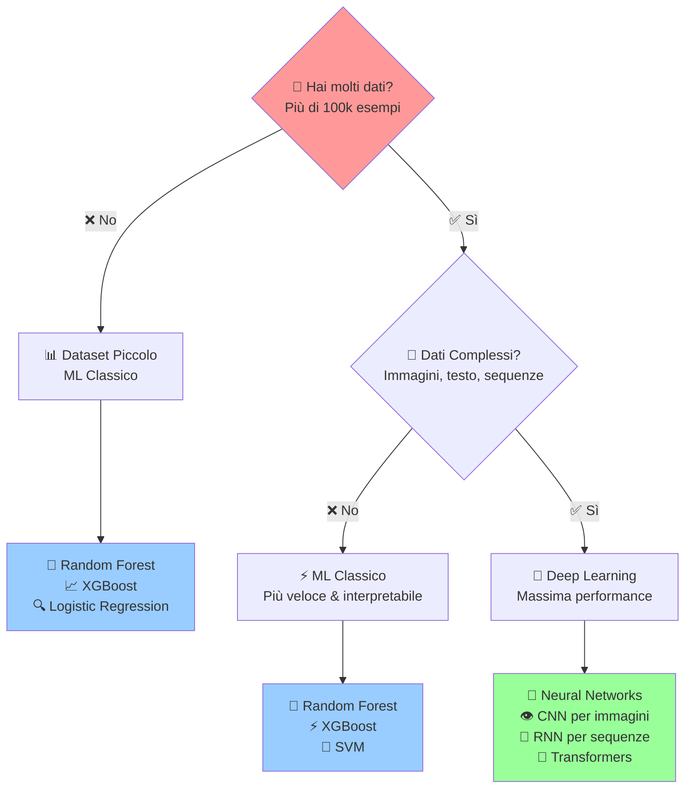

# 🚀 Machine Learning vs Deep Learning  
## La Guida Definitiva per Scegliere l'Approccio Giusto

---

## 🔍 **Flowchart Decisionale**

---

## 📊 **Machine Learning Classico**

### ✅ **Quando Usarlo**
| Criterio | Dettaglio |
|----------|-----------|
| 📏 **Dimensione Dataset** | < 100,000 esempi |
| 🗂️ **Tipo di Dati** | Feature tabellari (numeriche/categoriche) |
| 🔍 **Interpretabilità** | Serve capire "perché" il modello decide |
| ⏱️ **Tempo di Training** | Veloce (minuti/ore) |
| 💰 **Risorse** | CPU sufficiente |

### 🎯 **Algoritmi Top**
- 🌲 **Random Forest** → Robusto, poca manutenzione
- ⚡ **XGBoost** → Prestazioni superiori su dati tabellari
- 📈 **Logistic Regression** → Semplice e interpretabile
- 🎪 **SVM** → Ottimo con feature ben definite

### 🏆 **Esempi Pratici**
- 📊 Predire vendite da dati storici
- 🏥 Diagnosi medica da parametri clinici
- 💳 Rilevamento frodi bancarie
- ⚽ Risultati sportivi da statistiche

---

## 🧠 **Deep Learning**

### ✅ **Quando Usarlo**
| Criterio | Dettaglio |
|----------|-----------|
| 📏 **Dimensione Dataset** | > 100,000 esempi (idealmente milioni) |
| 🧩 **Tipo di Dati** | Complessi: immagini, audio, testo, video |
| 🔍 **Interpretabilità** | Non prioritaria |
| ⏱️ **Tempo di Training** | Lento (ore/giorni) |
| 💰 **Risorse** | GPU necessaria |

### 🚀 **Architetture Top**
- 👁️ **CNN** → Computer Vision (immagini/video)
- 📝 **RNN/LSTM** → Sequenze temporali
- 🤖 **Transformers** → NLP, traduzione
- 🔮 **Deep Neural Networks** → Pattern complessi

### 🌟 **Esempi Pratici**
- 📸 Riconoscimento oggetti in immagini
- 🗣️ Assistenti vocali (Alexa, Siri)
- 🌐 Traduzione automatica
- 🎮 AI per videogiochi

---

## ⚖️ **Confronto Rapido**

| Aspetto | 📊 ML Classico | 🧠 Deep Learning |
|---------|----------------|------------------|
| **Setup** | 🟢 Facile | 🟡 Complesso |
| **Dati richiesti** | 🟢 Pochi | 🔴 Molti |
| **Tempo training** | 🟢 Veloce | 🔴 Lento |
| **Interpretabilità** | 🟢 Alta | 🔴 Bassa |
| **Performance max** | 🟡 Buona | 🟢 Eccellente |
| **Costo computazionale** | 🟢 Basso | 🔴 Alto |

---

## 💡 **Regola d'Oro**

> **Inizia sempre con ML Classico!** Se non funziona abbastanza bene e hai molti dati, allora passa al Deep Learning.

---

## 🎯 **Quick Start Decision Tree**

1. **🤔 Che problema hai?**
   - Dati tabellari → ML Classico
   - Immagini/Video → Deep Learning
   - Testo → Deep Learning (se > 10k documenti)

2. **📊 Quanti dati hai?**
   - < 1k → ML Classico semplice
   - 1k-100k → ML Classico avanzato
   - > 100k + dati complessi → Deep Learning

3. **⏰ Quanto tempo hai?**
   - Prototipo rapido → ML Classico
   - Prodotto finale → Considera Deep Learning

---

*🚀 Buon Machine Learning!*

                 Hai molti dati? (>> 100k esempi)
                        |
             ┌──────────┴───────────────────────────┐
             |                                      |
             No                                     Sì
             |                                      |
     --------------------                       I dati sono complessi?
     |                  |                       (sequenze, immagini, testo,
    Dataset piccolo   Tabellare                 tracking, raw data)
    (<100k esempi)     con feature                     |
     |             già ingegnerizzate                  |
     |                  |                              |
    ML classico         |                       ┌──────┴───────┐
    (Logistic, RF,      |                       |              |
    XGBoost, SVM…)      |                       No             Sì
                        |                       |              |
                ML classico (più              ML classico    Deep Learning
           efficiente e interpretabile)       (XGBoost,RF)    (RNN, CNN, Transformer)
       
✅ Quando usare ML classico

Dataset < 100k esempi.

Feature già “tabellari” (gol, tiri, possesso, ecc.).

Serve interpretabilità.

Esempi: predire risultato Serie A da statistiche → Logistic Regression, Random Forest, XGBoost.

✅ Quando usare Deep Learning

Dataset molto grande (> 100k esempi, idealmente milioni).

Feature complesse (time series, sequenze di eventi, tracking giocatori, video, testo).

Non ti serve interpretabilità immediata, ma prestazioni.

Esempi: predire azioni di gioco da video → CNN/Transformer.